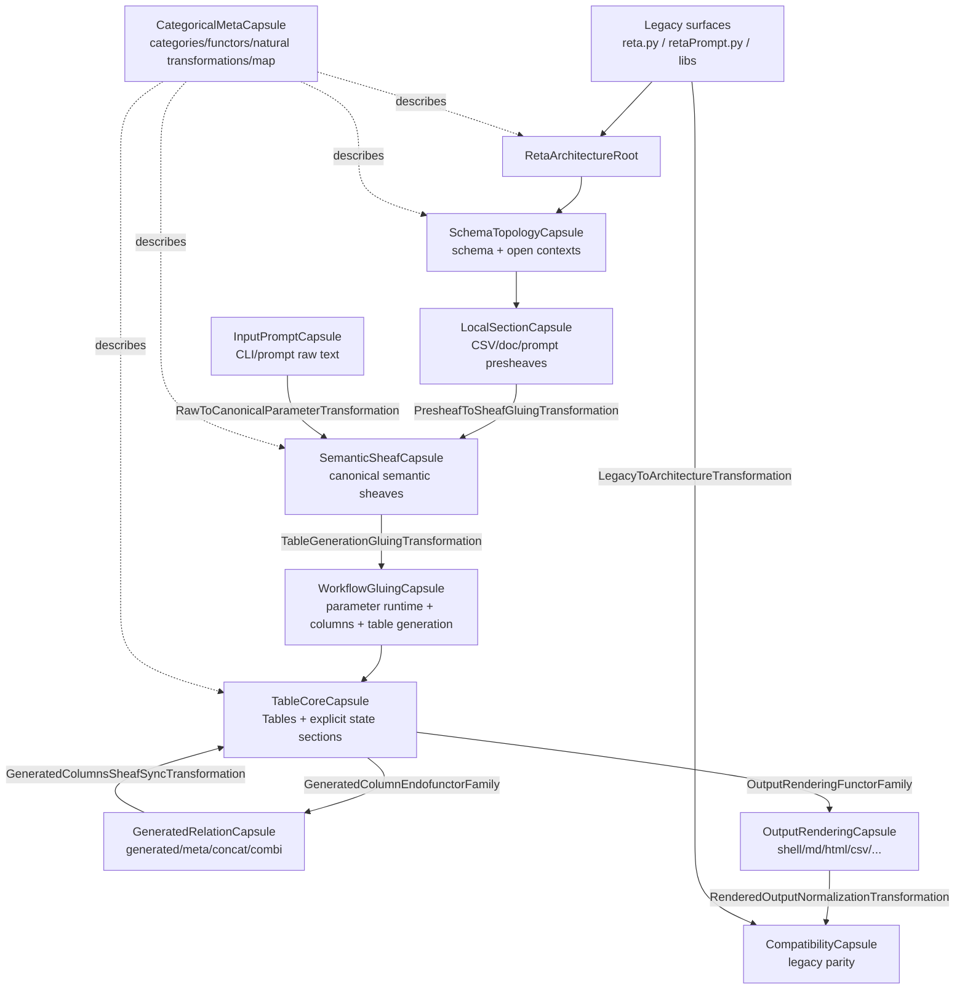

# Stage 28 – Gesamtarchitektur als Kapselkarte

Stage 28 baut direkt auf Stage 27 auf. Stage 27 hat Kategorien, Funktoren und natürliche Transformationen explizit gemacht. Stage 28 zeichnet die Architektur darüber als Kapsel- und Datenflusskarte, damit klar wird, **was in was von reta steckt** und welche alte reta-Datei jetzt welcher neuen Architekturrolle entspricht.

## Ausgangslage

Vor Stage 28 war die mathematische Metaschicht vorhanden:

- Topologie
- Morphismen
- universelle Eigenschaften / Gluing
- Prägarben
- Garben
- math Kategorien
- Funktoren
- natürliche Transformationen

Was noch fehlte, war die Gesamtkarte:

```text
Welche alte reta-Komponente wird welche Kapsel?
Welche Kapsel enthält welche Unterkapsel?
Wie fließen Rohdaten, Prompt/CLI, Semantik, Tabelle und Ausgabe durch das System?
Welche Stages haben welche Kapseln erzeugt?
```

## Neue Schicht

### `reta_architecture/architecture_map.py`

Neue, bewusst leichte Architekturkarte:

- `ArchitectureCapsuleSpec`
- `ArchitectureFlowSpec`
- `RetaPartMappingSpec`
- `StageArchitectureStep`
- `CapsuleContainmentSpec`
- `MarkdownAuditSpec`
- `ArchitectureMapBundle`
- `bootstrap_architecture_map(...)`

Diese Schicht ändert kein Runtime-Verhalten. Sie macht die bestehende Architektur als Kapselbaum, Datenfluss und Legacy-zu-Neu-Zuordnung inspizierbar.

## Kapselbaum

```text
RetaArchitectureRoot
├─ SchemaTopologyCapsule
│  ├─ i18n words_context / words_matrix / words_runtime
│  ├─ RetaContextSchema
│  └─ RetaContextTopology + ContextSelection
├─ LocalSectionCapsule
│  ├─ CSV / docs / translations / prompt raw state
│  └─ PresheafBundle(LocalSection, FilesystemPresheaf, PromptStatePresheaf)
├─ SemanticSheafCapsule
│  ├─ ParameterSemanticsSheaf
│  ├─ GeneratedColumnsSheaf
│  ├─ TableOutputSheaf
│  └─ HtmlReferenceSheaf
├─ InputPromptCapsule
│  ├─ InputBundle + RowRangeSyntax + PromptVocabulary
│  ├─ PromptRuntime + CompletionRuntime + PromptLanguage
│  └─ PromptSession + PromptExecution + PromptPreparation + PromptInteraction
├─ WorkflowGluingCapsule
│  ├─ ParameterRuntime
│  ├─ ColumnSelection
│  ├─ ProgramWorkflow
│  └─ TableGeneration + UniversalBundle
├─ TableCoreCapsule
│  ├─ TableRuntime.Tables = global table section
│  ├─ TableStateSections = explicit mutable sections
│  ├─ TablePreparation + RowFiltering + Wrapping
│  └─ NumberTheory
├─ GeneratedRelationCapsule
│  ├─ GeneratedColumns + MetaColumns
│  ├─ ConcatCsv / fractional CSV gluing
│  └─ KombiJoin
├─ OutputRenderingCapsule
│  ├─ OutputSyntax
│  ├─ OutputSemantics
│  └─ TableOutput renderers
├─ CompatibilityCapsule
│  ├─ reta.py / retaPrompt.py
│  ├─ libs compatibility facades
│  └─ parity + package integrity
└─ CategoricalMetaCapsule
   ├─ CategoryTheoryBundle
   └─ ArchitectureMapBundle
```

## Mermaid-Gesamtfluss



## Was aus reta was wird

| Alte reta-Komponente | Neue Kapsel | Neuer Besitzer | Mathematische Rolle |
|---|---|---|---|
| `i18n/words.py` | `SchemaTopologyCapsule`, `SemanticSheafCapsule` | `schema.py`, `semantics_builder.py`, split `words_*` | Topologie, Garbe, Prägarbenindex |
| `csv/*.csv` | `LocalSectionCapsule` | `presheaves.py`, `concat_csv.py`, `table_generation.py` | lokale Prägarben-Sektionen, CSV-Gluing |
| `reta.py` | `WorkflowGluingCapsule`, `CompatibilityCapsule` | `parameter_runtime.py`, `column_selection.py`, `program_workflow.py`, `table_generation.py` | universelle Eigenschaft, Gluing, Runtime-Funktor |
| `retaPrompt.py` | `InputPromptCapsule` | prompt runtime/completion/language/session/execution/preparation/interaction | Raw-command Prägarbe, Prompt-Morphismen, natürliche Transformation Raw→Canonical |
| `libs/center.py` | `InputPromptCapsule` | `input_semantics.py`, `row_filtering.py` | Eingabe-/Zeilen-Morphismen |
| `libs/LibRetaPrompt.py` | `InputPromptCapsule` | `input_semantics.py`, `prompt_runtime.py`, `completion_runtime.py`, `prompt_language.py` | Prompt-Funktoren, lokale Prompt-Sektionen |
| `libs/nestedAlx.py` | `InputPromptCapsule` | `completion_runtime.py`, `prompt_language.py` | Completion-/Prompt-Sprachmorphismus |
| `libs/lib4tables.py` | `OutputRenderingCapsule`, `TableCoreCapsule` | `output_syntax.py`, `output_semantics.py`, `number_theory.py` | OutputFormatCategory, Renderer-Morphismen |
| `libs/tableHandling.py` | `TableCoreCapsule`, `GeneratedRelationCapsule`, `OutputRenderingCapsule` | `table_runtime.py`, `table_state.py`, `table_output.py`, `combi_join.py`, `generated_columns.py` | globale Tabellensektion, Tabellenzustand, Endofunktoren |
| `libs/lib4tables_prepare.py` | `TableCoreCapsule` | `table_preparation.py`, `row_filtering.py`, `table_wrapping.py` | Prepare-/Zeilen-/Wrapping-Morphismen |
| `libs/lib4tables_concat.py` | `GeneratedRelationCapsule` | `generated_columns.py`, `meta_columns.py`, `concat_csv.py`, `combi_join.py` | Tabellen-Endofunktoren, CSV-Prägarben-Gluing |
| `libs/lib4tables_Enum.py` | `SchemaTopologyCapsule`, `GeneratedRelationCapsule` | `schema.py`, `generated_columns.py`, `table_state.py` | Tags als Topologie-/Generated-Column-Metadaten |

## Stageweise Kapselung

Stage 28 registriert jetzt 28 Schritte im `ArchitectureMapBundle`. Die kurze Lesart:

1. Stage 1: Architekturpaket mit Topologie/Prägarben/Garben/Morphismen/Universalität.
2. Stage 2: Schema und Parameter-Semantik-Builder.
3. Stage 3: physischer Split von `i18n/words.py`.
4. Stage 4: Input-Semantik.
5. Stage 5: Output-Semantik.
6. Stage 6-12: Prompt-Kapseln: Runtime, Completion, Sprache, Session, Execution, Preparation, Interaction.
7. Stage 13-15: Spaltenauswahl, Tabellen-Gluing, Parameter-Runtime, Program-Workflow.
8. Stage 16: Table Preparation.
9. Stage 17-19: Generated Columns, Meta Columns, CSV-/Bruch-Gluing.
10. Stage 20-24: Table Output, Combi Join, Row Filtering, Wrapping, Number Theory, Output Syntax.
11. Stage 25-26: Table Runtime als globale Sektion und explizite Table State Sections.
12. Stage 27: Kategorien, Funktoren und natürliche Transformationen.
13. Stage 28: Kapselkarte und Gesamtarchitekturdiagramm.

## Architektur-Integration

`RetaArchitecture` besitzt jetzt zusätzlich:

```python
architecture_map: ArchitectureMapBundle
```

Neuer Bootstrap:

```python
RetaArchitecture.bootstrap_architecture_map(...)
```

`snapshot()` enthält jetzt:

```python
"architecture_map": ...
```

## Probe-Werkzeug

Neue Probe-Kommandos:

```bash
python -B -S reta_architecture_probe_py.py architecture-map-json
python -B -S reta_architecture_probe_py.py architecture-diagram-md
```

`architecture-map-json` liefert:

- Kapseln
- Enthält-Beziehungen
- Datenflüsse
- Legacy-zu-Neu-Mappings
- Stage-Schritte 1 bis 28
- Textdiagramm
- Mermaid-Diagramm
- Markdown-Audit

`architecture-diagram-md` gibt direkt eine Markdown-/Mermaid-Darstellung aus.

## Markdown-Audit

Im Stage-27-Paket wurden 58 Markdown-Dateien als Historienbasis gefunden:

- `ARCHITECTURE_REFACTOR*.md`
- `STAGE*_CHANGES.md`
- `PACKAGE_AUDIT_STAGE*.md`
- `readme-reta*.md`
- `readme-retaPrompt*.md`
- `readme-startFiles.md`

Das neu hochgeladene `retaPyNewArch.tar.bz2` enthielt in dieser Umgebung keine Markdown-Dateien. Stage 28 hält diese Abweichung im `MarkdownAuditSpec` fest und baut auf dem Stage-27-Paket auf.

## Tests

Neue Regressionen prüfen:

- `ArchitectureMapBundle` ist explizit vorhanden.
- `RetaArchitecture.snapshot()` enthält `architecture_map`.
- Kapseln, Flüsse, Legacy-Mappings und Stage-Schritte sind registriert.
- Text- und Mermaid-Diagramme sind im Snapshot enthalten.
- Markdown-Audit enthält die beobachteten Dateizahlen.
- Paketmanifest enthält `reta_architecture/architecture_map.py`.

## Architekturgewinn

Vor Stage 28:

```text
math Objekte waren benannt, aber die Gesamtarchitektur war nur indirekt aus den Stage-Dateien rekonstruierbar.
```

Nach Stage 28:

```text
Reta hat eine explizite Kapselkarte:
Legacy → Topologie → Prägarben → Garben → universelles Gluing → Tabellen-Sektion → Morphismen/Endofunktoren → Renderer → Parität
```

Damit ist nicht nur klar, dass es Topologie, Morphismen, Garben, Kategorien, Funktoren und natürliche Transformationen gibt, sondern auch, **wo sie in reta sitzen**.

## Geprüft

- `py_compile`: OK
- `architecture-map-json`: OK
- `architecture-diagram-md`: OK
- `package-integrity-json`: OK, keine fehlenden Pflichtdateien
- `tests.test_architecture_refactor`: **48 Tests, OK**
- `tests.test_command_parity`: **1 Test, OK**
- volle Unittest-Discovery: **49 Tests, OK**
